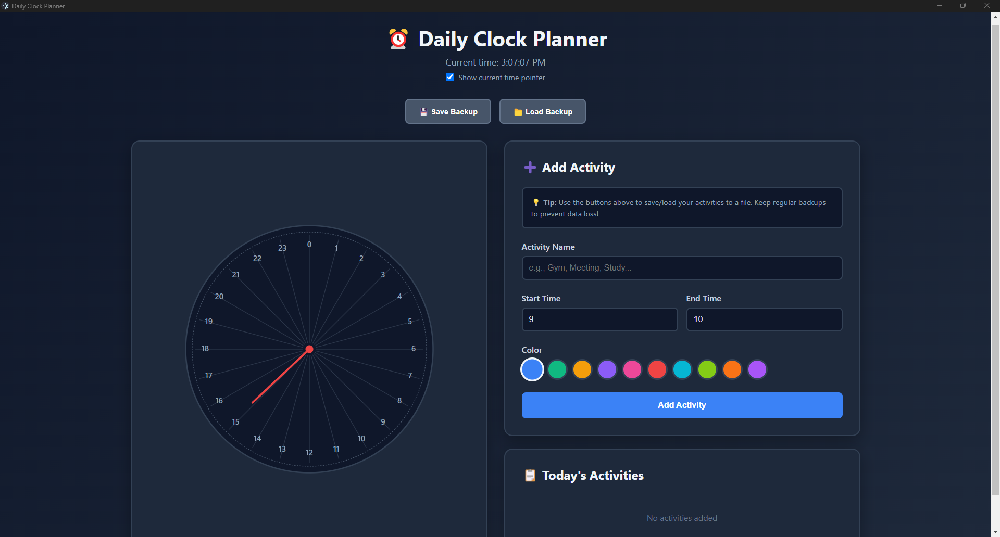

# ⏰ Daily Clock Planner

A visual 24-hour clock application for planning and managing your daily schedule. Built with Electron.


## Features

- 📊 **24-hour analog clock visualization** - See your entire day at a glance
- 🎨 **10 color options** - Organize activities by category
- 💾 **Save/Load backups** - Keep your schedules in JSON files
- 🌙 **Dark theme** - Easy on the eyes
- ⏱️ **Real-time updates** - Clock updates every second
- 🔴 **Toggle time pointer** - Show/hide current time indicator
- 📴 **100% offline** - No internet required

## Screenshot



## Installation

### Option 1: Download Release (Recommended)
1. Go to [Releases](../../releases)
2. Download `Daily.Clock.Planner.Setup.1.0.0.exe`
3. Run the installer
4. Launch from Desktop or Start Menu

### Option 2: Build from Source
See [build-instructions.txt](Installation/build-instructions.txt) for detailed build guide.

**Quick start:**
```bash
cd Installation
npm install
npm start        # Run in development
npm run build-win  # Build Windows installer
```

## Usage

1. **Add Activity** - Enter name, set start/end times, pick a color
2. **View on Clock** - Activities appear as colored slices
3. **Save Backup** - Export your schedule to a JSON file
4. **Load Backup** - Import a previously saved schedule

### Tips
- Use colors to categorize activities (blue for work, green for breaks, etc.)
- Save different schedules for weekdays vs weekends
- Toggle the time pointer when you just want to view the plan

## Tech Stack

- [Electron](https://www.electronjs.org/) - Desktop application framework
- [Electron Builder](https://www.electron.build/) - Packaging and distribution
- Vanilla JavaScript - No frameworks needed
- SVG - Clock visualization

## Project Structure

```
DailyClockPlanner/
├── Installation/
│   ├── main.js              # Electron main process
│   ├── index.html           # UI and application logic
│   ├── package.json         # Dependencies and build config
│   ├── create-shortcut.js   # Post-build shortcut creator
│   └── build-instructions.txt
├── Saves/                   # Auto-created for backups
├── LICENSE
└── README.md
```

## Requirements

- **Windows 10+** / macOS / Linux
- **Node.js 18+** (for building only)
- ~200 MB disk space

## Contributing

Contributions are welcome! Feel free to:

1. Fork the repository
2. Create a feature branch (`git checkout -b feature/amazing-feature`)
3. Commit your changes (`git commit -m 'Add amazing feature'`)
4. Push to the branch (`git push origin feature/amazing-feature`)
5. Open a Pull Request

## License

This project is licensed under the MIT License - see the [LICENSE](LICENSE) file for details.

## Acknowledgments

- Built with assistance from Claude (Anthropic)
- Inspired by the need for simple, visual time management
